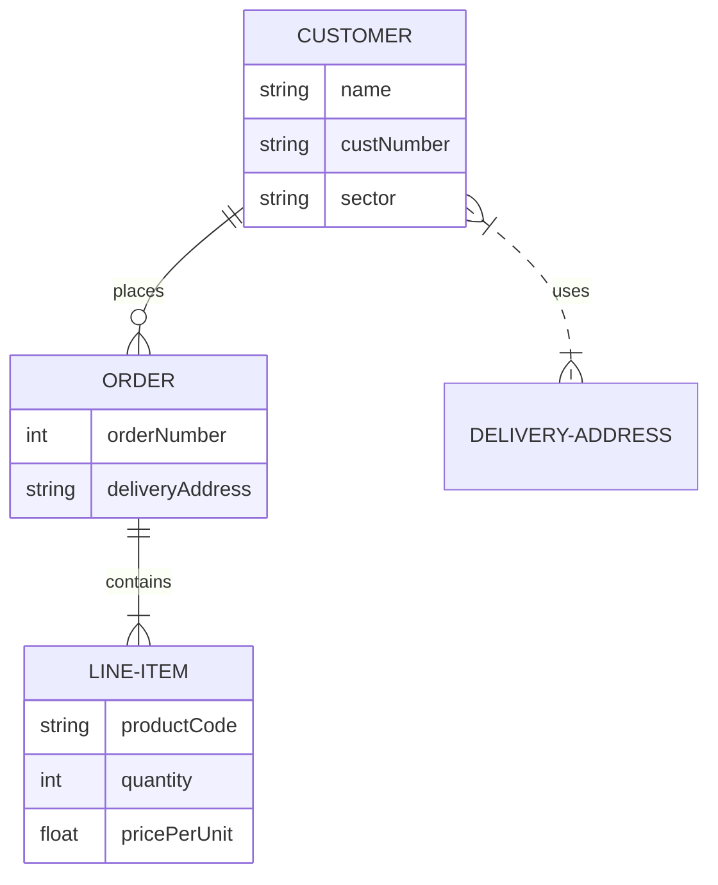

## Spring Boot

Check the [initial setup guide here](./docs/initial-setup.md)

Once, you have setup the project, you can start creating the controllers and services. Check this [guide to create controllers and know about annotations](./docs/springboot-annotations.md).

## Diagrams

`||` means exactly 1 
`}o` and `o{` means 0 or more 
`}|` and `|{` means 1 or more 

Link to mermaid:

https://mermaid.js.org/syntax/entityRelationshipDiagram.html

###

In the VSCOde extension tab search `bierner.markdown-mermaid` and install for VSCode memaid syntax support
